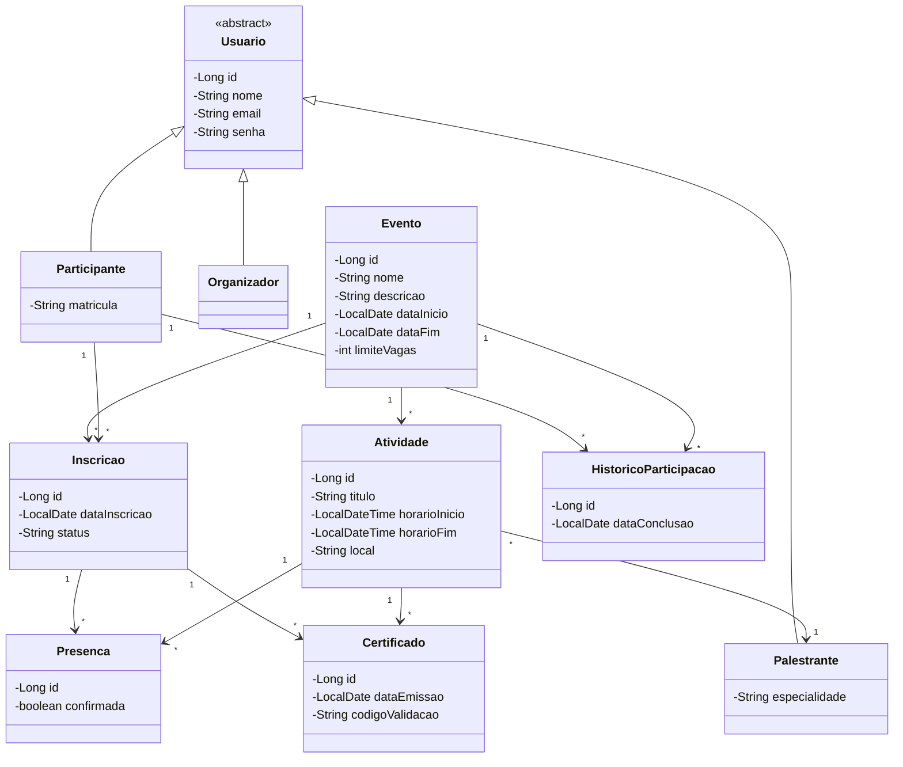

## Diagrama

```mermaid
classDiagram
    class Usuario {
        <<abstract>>
        -Long id
        -String nome
        -String email
        -String senha
    }

    class Participante {
        -String matricula
    }

    class Organizador

    class Palestrante {
        -String especialidade
    }

    class Evento {
        -Long id
        -String nome
        -String descricao
        -LocalDate dataInicio
        -LocalDate dataFim
        -int limiteVagas
    }

    class Atividade {
        -Long id
        -String titulo
        -LocalDateTime horarioInicio
        -LocalDateTime horarioFim
        -String local
    }

    class Inscricao {
        -Long id
        -LocalDate dataInscricao
        -String status
    }

    class Presenca {
        -Long id
        -boolean confirmada
    }

    class Certificado {
        -Long id
        -LocalDate dataEmissao
        -String codigoValidacao
    }

    class HistoricoParticipacao {
        -Long id
        -LocalDate dataConclusao
    }

    Usuario <|-- Participante
    Usuario <|-- Organizador
    Usuario <|-- Palestrante

    Evento "1" --> "*" Atividade
    Atividade "*" --> "1" Palestrante

    Evento "1" --> "*" Inscricao
    Participante "1" --> "*" Inscricao

    Inscricao "1" --> "*" Presenca
    Atividade "1" --> "*" Presenca

    Inscricao "1" --> "*" Certificado
    Atividade "1" --> "*" Certificado

    Participante "1" --> "*" HistoricoParticipacao
    Evento "1" --> "*" HistoricoParticipacao
```

